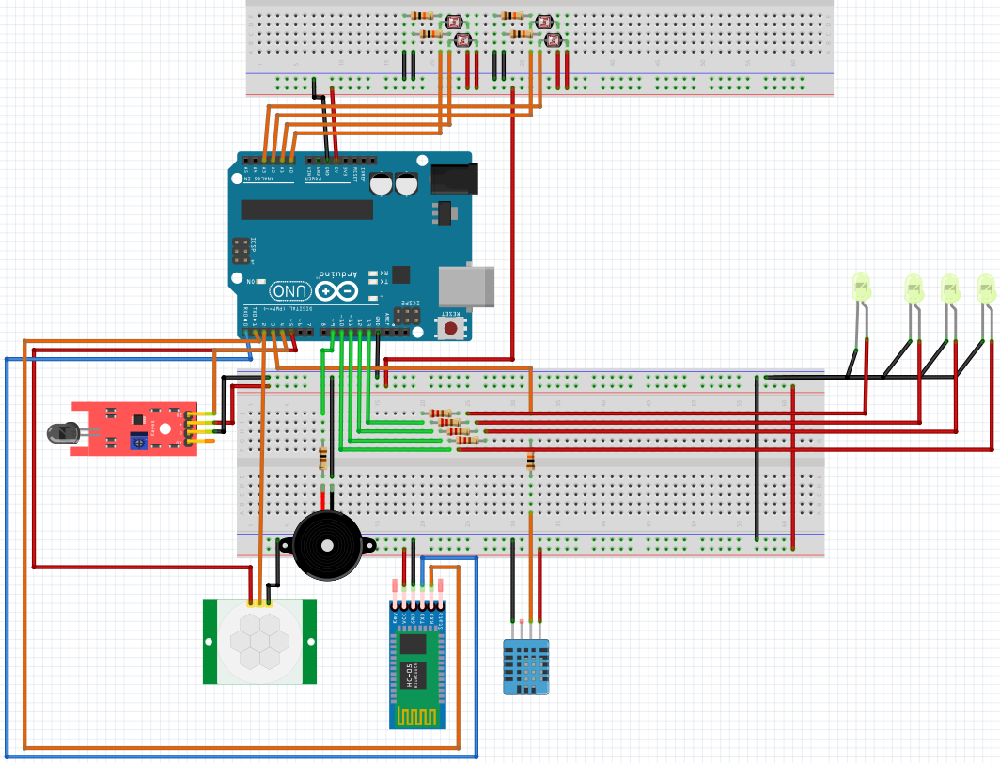

# DOMOTICA - BAV

<!-- PROJECT SHIELDS -->
[![Contributors][contributors-shield]][contributors-url]
[![LinkedIn][linkedin-shield]][linkedin-url]


<!-- PROJECT LOGO -->
<br />
<p align="center">
  <a href="https://github.com/jdaldeco/domotica.git">
    
  </a>

  <h3 align="center">Domótica</h3>

  <p align="center">
    A Smart house system created using Arduino and Android to control and monitor (Light, doors, security alarm) a house using your phone and voice control, plus a monitor  system created with Python
    <br />
    <a href="https://github.com/jdaldeco/domotica"><strong>Explore the docs »</strong></a>
  </p>
</p>

<!-- ABOUT THE PROJECT -->
## About The Project
The project consists of a Smart House using sensors which are being monitored by the UI.<br>

Python UI using Tkinter
Arduino code to manage sensors
SQL BD to storage all the events that sensors send

## Circuit
<hr>

<br>

## Materials and Components
<ul>
  <li>Arduino UNO</li>
  <li>LED (4)</li>
  <li>Photoresistor (4)</li>
  <li>Moisture sensor</li>
  <li>Flame detector</li>
  <li>Bluetooth module</li>
  <li>PIR sensor</li>
  <li>Buzzer</li>
</ul>
<br>

Team members:
<ul>
  <li><a>Jesús Daniel Aldeco Valenzuela</a></li>
  <li><a>Cristina Aideé Blanco Castro</a></li>
  <li><a>Jesús Armando Valencia Chan</a></li>
</ul>

<br>


## Prerequisites

<ul>
  <li><a>SQL Server</a></li>
  <li><a>Python</a></li>
  <li><a>Arduino</a></li>
</ul>

## Installation

1. Clone the repo
   ```sh
   git clone https://github.com/jdaldeco/domotica.git
   ```


<!-- MARKDOWN LINKS & IMAGES -->
<!-- https://www.markdownguide.org/basic-syntax/#reference-style-links -->
[contributors-shield]: https://img.shields.io/github/contributors/github_username/repo.svg?style=for-the-badge
[contributors-url]: https://github.com/jdaldeco/domotica/graphs/contributors
[linkedin-shield]: https://img.shields.io/badge/-LinkedIn-black.svg?style=for-the-badge&logo=linkedin&colorB=555
[linkedin-url]: https://www.linkedin.com/in/jes%C3%BAs-daniel-aldeco-valenzuela-825592198/
